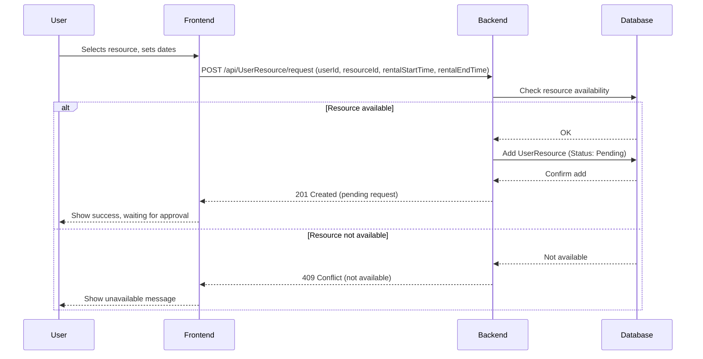
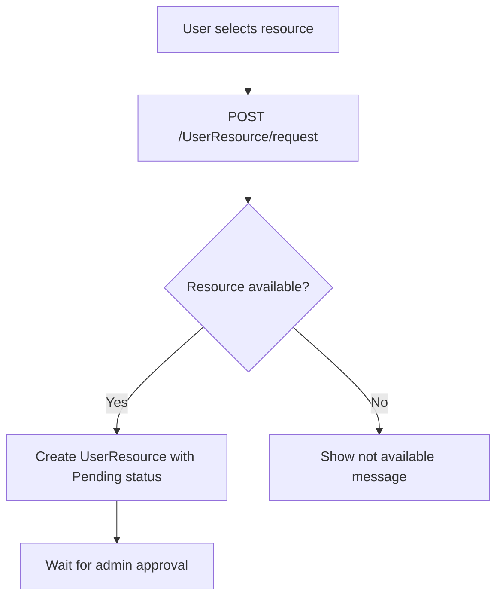

# Reserve App Frontend

Frontend aplikacji do rezerwacji zasobow oparty o Next.js (React). Pozwala na rejestracje, logowanie, przeglad zasobow, skladanie requestow, zarzadzanie historia wypozyczen oraz korzystanie z panelu admina.

---

## Spis tresci

- [Opis projektu](#opis-projektu)
- [Diagramy](#diagramy)
- [Wymagania funkcjonalne](#wymagania-funkcjonalne)
- [Wymagania niefunkcjonalne](#wymagania-niefunkcjonalne)
- [Wymagania systemowe](#wymagania-systemowe)
- [Instalacja](#instalacja)
- [Uruchomienie](#uruchomienie)
- [Struktura projektu](#struktura-projektu)
- [Glowne funkcje](#glowne-funkcje)
- [Przykladowe scenariusze uzycia](#przykladowe-scenariusze-uzycia)
- [Wspoltworzenie](#wspoltworzenie)
- [Licencja](#licencja)
- [Kontakt](#kontakt)

---

## Opis projektu

Aplikacja pozwala uzytkownikom na przegladanie i wypozyczanie zasobow (np. sprzet, sale), skladanie requestow na wybrane terminy, przegladanie historii wypozyczen oraz zarzadzanie profilem. Administrator moze zatwierdzac/odrzucac requesty i przegladac obecne wypozyczenia.

---

## Diagramy

### Sequence diagram – Resource Request



### Flowchart – Resource Request



### Use Case diagram – Resource Request

```mermaid
usecaseDiagram
    actor User
    actor Admin

    User --> (Request resource)
    Admin --> (Approve or reject request)
    User --> (Receive request status notification)
```

---

## Wymagania funkcjonalne

1. Rejestracja i logowanie
2. Przeglad i wyszukiwanie zasobow
3. Requestowanie zasobow na wybrane terminy
4. Przeglad aktualnych wypozyczen
5. Historia wypozyczen (UserHistory) z filtrowaniem i sortowaniem
6. Edycja profilu uzytkownika
7. Panel admina: zatwierdzanie/odrzucanie requestow, przeglad expired resources
8. Powiadomienia o statusie operacji

---

## Wymagania niefunkcjonalne

- Szybkie ladowanie (dev/prod)
- Responsywnosc (mobile/desktop)
- Zgodnosc z WCAG 2.1 AA
- Bezpieczenstwo (XSS/CSRF, JWT)
- Kompatybilnosc z popularnymi przegladarkami
- Kod zgodny z ESLint, modularnosc

---

## Wymagania systemowe

- Node.js 16+
- npm lub yarn
- Przegladarka internetowa

---

## Instalacja

```bash
npm install
# lub
yarn install
```

---

## Uruchomienie

```bash
npm run dev
# lub
yarn dev
```
Aplikacja bedzie dostepna na [http://localhost:3000](http://localhost:3000)

---

## Struktura projektu

- `src/app/` – strony (user, admin, zasoby, historia)
- `src/components/` – komponenty UI (RequestForm, RequestCard, HistoryResourceCard itp.)
- `src/components/api.js` – komunikacja z backendem
- `public/` – pliki statyczne

---

## Glowne funkcje

- Rejestracja i logowanie
- Requestowanie i przeglad zasobow
- Historia wypozyczen z filtrowaniem/sortowaniem
- Panel admina: zarzadzanie requestami i expired resources
- Edycja profilu

---

## Przykladowe scenariusze uzycia

- Uzytkownik loguje sie, sklada request na zasob, sprawdza status w historii
- Administrator zatwierdza lub odrzuca requesty
- Uzytkownik przeszukuje historie wypozyczen po nazwie zasobu

---

## Wspoltworzenie

1. Fork repozytorium
2. Stworz galez (`feature/nazwa`)
3. Dodaj zmiany i testy
4. Zglos Pull Request

---

## Licencja

MIT
